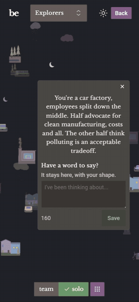

## Butterfly Effect, Gamified City Simulation

Butterfly Effect features a custom 2.5D implementation on the Canvas2D API to render city scenery. Same system computes offscreen sprites for a Three.js (WebGL) instance for collective visualizations in 3D space.

  
  

 

- Users simulate changes in the scene by clicking or tapping multi-select input signals.
- Once completed, individual results are added to the UI layer with `solo/team` toggle, tooltips and section filters.
- Every previous user is part of the collective visualization with their (optional) messages.
- Features a logs table, bar graphs with a personal anchor, and per question comparisons.

 

  
  

 

## What would I do differently? 
Although this version of the scene engine performed well on desktop and iOS devices, testing on lower-end Android hardware showed that some visual effects and redraw patterns were too expensive across the full device range.

From that hands-on experience, I started building `Canvas Engine`: a specialized, renderer-agnostic system. The new engine separates draw instructions from the renderer through a rich `.txt`-based declarative notation, keeps renderer lifecycle and cache invalidation tightly controlled, and prevents the main loop from overreaching into application logic. It targets WebGPU first, with WebGL fallback support for older devices.

### Repository for the new system

 

### Architecture
| | |
| :--- | :--- |
| **Scene Canvas** | Grid layout, scene rules, shape modifiers parameterize `Canvas2D` draw arguments (transforms, colors, particles) from live input signals, and multi-canvas orchestration through a single requestAnimationFrame instance | 
| **Sprite Pipeline** | Epoch texture update scheduler, quality upgrade scheduler, quantizes value that drives shape uniqueness for higher cache performance *(consumes scene canvas and Three.js)* |
| **Three.js / WebGL** | Culling, 3D math, distance-based rotation speed and hitbox scaling with debounce during zoom, tooltip anchoring, and camera orchestration for the community graph *(consumes sprites)* |
| **React + SSR API** | `renderToPipeableStream` for server-side rendering, client hydration and state management |
| **Node.js** | Parses Vite build manifest, dynamically imports compiled SSR bundle |
| **Express** | Routes to data validation before Sanity writes, rate limiter, serving index HTML, and streaming React components |
| **Web Worker** | offloads scene placement computation, removing latency during user-input recomputation |
| **Sanity CMS** | Anonymous document writes for survey responses; dataset reads for community graph and gamification copy |
| **AWS EC2** | Production deployment |

 

### 📬 Contact & Questions

If you have any questions, feel free to reach out to me at: **eozalp.efe@gmail.com**