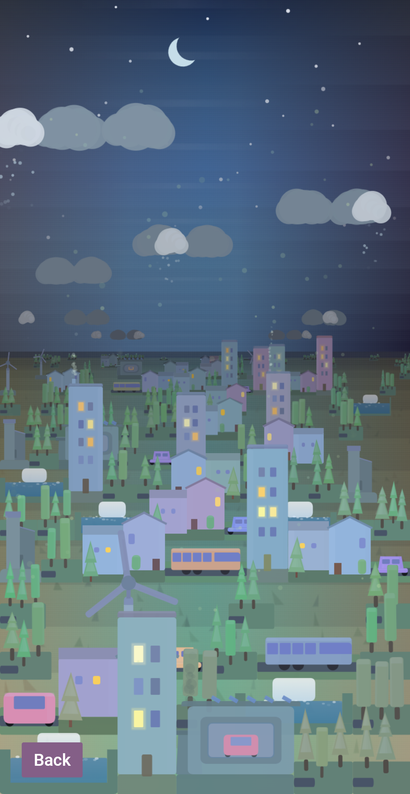

## Butterfly Effect: Gamified City Simulation

An application that uses a custom 2.5D Canvas2D implementation to render an interactive city scene. The same scene functions compute draw arguments and generate offscreen sprites for a Three.js/WebGL collective visualization in 3D space.

  
  

 

- Users simulate changes in the scene by clicking or tapping multi-select input signals.
- Once completed, individual results are added to the UI layer with `solo/team` toggle, tooltips and section filters.
- Every previous user is part of the collective visualization with their (optional) messages.
- Features a logs table, bar graphs with a personal anchor, and per question comparisons.

 

  
  
  

 

## What would I improve further?
Although this version of the scene engine performed well on desktop and iOS devices, testing on lower-end Android hardware showed that some visual effects and redraw patterns were too expensive across the full device range.

Recent profiling also led to replacing live Canvas2D brightness filters with a cheaper depth-mask overlay path and tuning distance-based bitmap caching.

From that hands-on experience, I started building `Canvas Engine`: an unopinionated rendering engine. It separates draw instructions from the renderer through a rich `.txt`-based declarative notation, keeps renderer lifecycle and cache invalidation tightly controlled, and prevents the main loop from overreaching into application logic. It targets WebGPU first, with WebGL fallback support for older devices.

 

### Repository for the new system

 

### Architecture

- Survey results are delivered through a server-managed SSE stream: newest-first snapshot chunks load history, then patch events carry live changes.
- Graph views stay client-capped for rendering, while logs and section counts use the streamed history loaded so far.
- Gamification copy is fetched through a cached Express endpoint that batches related Sanity CMS reads into one request.
- Survey submissions stay on separate Express POST endpoints, keeping writes explicit while live updates flow back through SSE.

| | |
| :--- | :--- |
| **Scene Canvas** | Grid layout, scene rules, shape modifiers parameterize `Canvas2D` draw arguments (transforms, colors, particles) from live input signals, and multi-canvas orchestration through a single requestAnimationFrame instance | 
| **Sprite Pipeline** | Epoch texture update scheduler, quality upgrade scheduler, quantizes value that drives shape uniqueness for higher cache performance *(consumes scene canvas and Three.js)* |
| **Three.js / WebGL** | Culling, 3D math, distance-based rotation speed and hitbox scaling with debounce during zoom, tooltip anchoring, and camera orchestration for the community graph *(consumes sprites)* |
| **React + SSR API** | `renderToPipeableStream` for server-side rendering and client hydration |
| **State Management** | Five app-wide slices; `CanvasRuntimeCtx` and `UiCtx` run on Zustand stores with per-field selectors so components re-render only on the fields they actually read, while `IdentityCtx`, `SurveyDataCtx`, and `PreferencesCtx` remain on React Context. Twelve components beneath the render-heavy parents are wrapped in `React.memo` to stop unrelated parent re-renders from cascading into children whose own props are unchanged. Benchmarked with a scripted Playwright pass: cut re-renders 21% (709 → 560) via Zustand; eliminated 16.7% (234 → 195) of re-executions via memoization |
| **Node.js** | Parses Vite build manifest, dynamically imports compiled SSR bundle |
| **Express** | Validates write requests before Sanity mutations, batches cached CMS reads, rate-limits API routes, serves the SSR document, and streams chunked survey snapshots plus live SSE patches |
| **Web Worker** | offloads scene placement computation, removing latency during user-input recomputation |
| **Sanity CMS** | Anonymous document writes for survey responses; paged dataset reads and change events for community graph, logs, and gamification copy |
| **AWS EC2** | Production deployment with automated deploys |

 

### Navigation

- [Scene Canvas](app/src/scene-canvas)
- [Graph Runtime](app/src/graph-runtime)

 

### 📬 Contact & Questions

If you have any questions, feel free to reach out to me at: **eozalp.efe@gmail.com**
