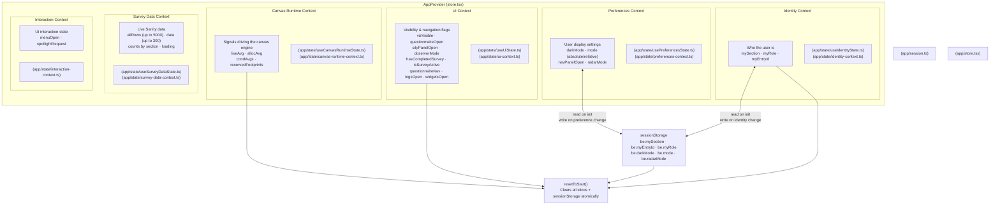

# App State Architecture

Six context slices composed in `AppProvider` and available to the entire component tree.

```mermaid
flowchart TD

    subgraph Provider ["AppProvider (store.tsx)"]

        subgraph Identity ["Identity Context"]
            IC["Who the user is\nmySection · myRole · myEntryId"]
            IC_note["(app/state/useIdentityState.ts)\n(app/state/identity-context.ts)"]
        end

        subgraph Preferences ["Preferences Context"]
            PC["User display settings\ndarkMode · mode (absolute/relative)\nnavPanelOpen · radarMode"]
            PC_note["(app/state/usePreferencesState.ts)\n(app/state/preferences-context.ts)"]
        end

        subgraph UI ["UI Context"]
            UC["Visibility & navigation flags\nvizVisible · questionnaireOpen\ncityPanelOpen · observerMode\nhasCompletedSurvey · isSurveyActive\nquestionnaireNav · logsOpen · widgetsOpen"]
            UC_note["(app/state/useUiState.ts)\n(app/state/ui-context.ts)"]
        end

        subgraph Canvas ["Canvas Runtime Context"]
            CC["Signals driving the canvas engine\nliveAvg · allocAvg\ncondAvgs · reservedFootprints"]
            CC_note["(app/state/useCanvasRuntimeState.ts)\n(app/state/canvas-runtime-context.ts)"]
        end

        subgraph SurveyData ["Survey Data Context"]
            SC["Live Sanity data\nallRows (up to 5000) · data (up to 300)\ncounts by section · loading"]
            SC_note["(app/state/useSurveyDataState.ts)\n(app/state/survey-data-context.ts)"]
        end

        subgraph Interaction ["Interaction Context"]
            IRC["UI interaction state\nmenuOpen · spotlightRequest"]
            IRC_note["(app/state/interaction-context.ts)"]
        end

    end

    Session["sessionStorage\nbe.mySection · be.myEntryId · be.myRole\nbe.darkMode · be.mode · be.radarMode"]
    Session_note["(app/session.ts)"]

    IC <-->|"read on init\nwrite on identity change"| Session
    PC <-->|"read on init\nwrite on preference change"| Session

    ResetToStart["resetToStart()\nClears all slices + sessionStorage atomically"]
    ResetToStart_note["(app/store.tsx)"]

    UC --> ResetToStart
    IC --> ResetToStart
    CC --> ResetToStart
    Session --> ResetToStart
```
