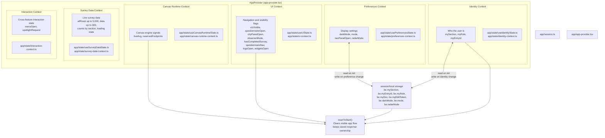

# App State Architecture

Six context slices are composed in `AppProvider` and exposed to the app tree.

## Response Ownership State

`be.myEditToken` is intentionally stored with the local response keys. It is the browser-side capability used to patch the optional solo message for the current response.

The raw token is never stored in Sanity. Sanity stores only `editTokenHash`, and the Supabase `save-solo-message` function validates a matching hash before patching `soloMessage`.

`resetToStart()` clears the visible app flow and transient submit flags, but it does not erase `be.myEntryId`, `be.myDoc`, or `be.myEditToken`. A user who clicks Back or refreshes after submitting should still be able to return to their saved response.

On page refresh, stored response ownership hydrates identity only; it does not reopen the graph. The app starts at the landing/onboarding flow, and the navigation View Now action restores the saved response into the live identity state before opening the graph. That keeps the user in the personalized graph path instead of downgrading them to observer mode.

Submitting a new survey starts a new edit-token session and overwrites `be.myEntryId`, `be.mySection`, and `be.myDoc`, so the browser points at the newest response instance.

Save failure is different: the optimistic response keys are removed because no durable Sanity document exists yet. Clearing browser storage has the same effect: the user can still view shared results, but the browser can no longer edit that submitted response.
