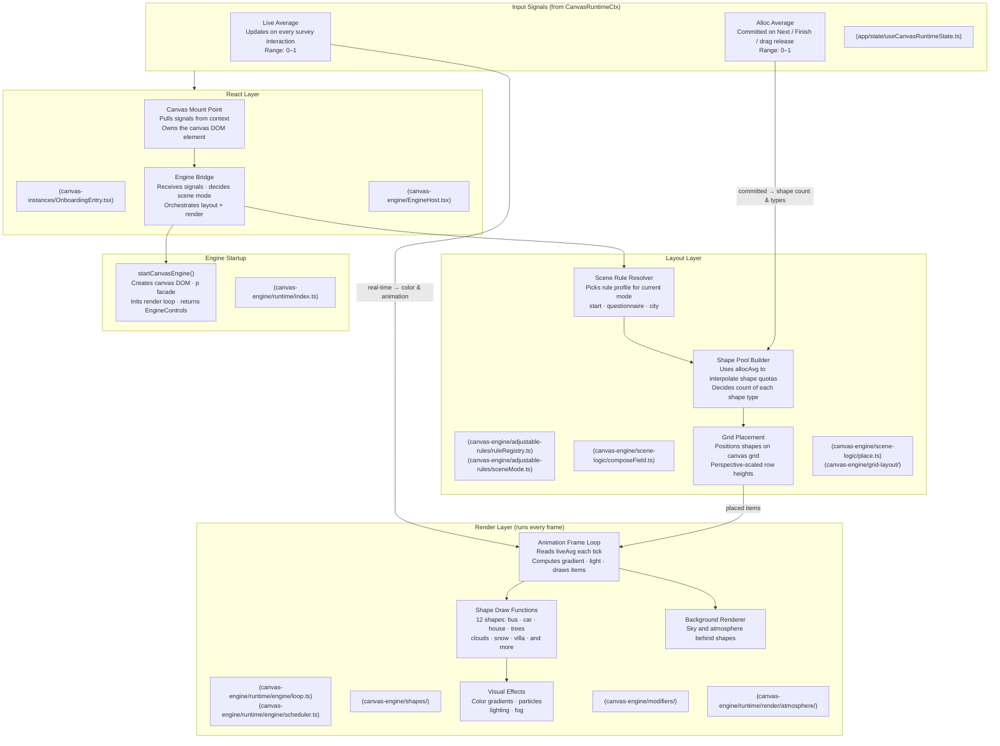

# Canvas Engine — Onboarding Scene

Custom 2D canvas renderer. Two input signals drive it: `liveAvg` for real-time visuals, `allocAvg` for scene composition.

```mermaid
flowchart TD

    subgraph Signals ["Input Signals (from CanvasRuntimeCtx)"]
        LiveAvg["Live Average\nUpdates on every survey interaction\nRange: 0–1"]
        AllocAvg["Alloc Average\nCommitted on Next / Finish / drag release\nRange: 0–1"]
        LiveAvg_note["(app/state/useCanvasRuntimeState.ts)"]
    end

    subgraph ReactLayer ["React Layer"]
        CanvasEntry["Canvas Mount Point\nPulls signals from context\nOwns the canvas DOM element"]
        CanvasEntry_note["(canvas-instances/OnboardingEntry.tsx)"]

        EngineHost["Engine Bridge\nReceives signals · decides scene mode\nOrchestrates layout + render"]
        EngineHost_note["(canvas-engine/EngineHost.tsx)"]

        CanvasEntry --> EngineHost
    end

    subgraph LayoutLayer ["Layout Layer"]
        SceneResolver["Scene Rule Resolver\nPicks rule profile for current mode\nstart · questionnaire · city"]
        SceneResolver_note["(canvas-engine/adjustable-rules/ruleRegistry.ts)\n(canvas-engine/adjustable-rules/sceneMode.ts)"]

        ShapePool["Shape Pool Builder\nUses allocAvg to interpolate shape quotas\nDecides count of each shape type"]
        ShapePool_note["(canvas-engine/scene-logic/composeField.ts)"]

        GridPlacement["Grid Placement\nPositions shapes on canvas grid\nPerspective-scaled row heights"]
        GridPlacement_note["(canvas-engine/scene-logic/place.ts)\n(canvas-engine/grid-layout/)"]

        SceneResolver --> ShapePool --> GridPlacement
    end

    subgraph RenderLayer ["Render Layer (runs every frame)"]
        RenderLoop["Animation Frame Loop\nReads liveAvg each tick\nComputes gradient · light · draws items"]
        RenderLoop_note["(canvas-engine/runtime/engine/loop.ts)\n(canvas-engine/runtime/engine/scheduler.ts)"]

        ShapeDrawers["Shape Draw Functions\n12 shapes: bus · car · house · trees\nclouds · snow · villa · and more"]
        ShapeDrawers_note["(canvas-engine/shapes/)"]

        VisualEffects["Visual Effects\nColor gradients · particles\nlighting · fog"]
        VisualEffects_note["(canvas-engine/modifiers/)"]

        Background["Background Renderer\nSky and atmosphere behind shapes"]
        Background_note["(canvas-engine/runtime/render/atmosphere/)"]

        RenderLoop --> ShapeDrawers --> VisualEffects
        RenderLoop --> Background
    end

    subgraph Engine ["Engine Startup"]
        StartEngine["startCanvasEngine()\nCreates canvas DOM · p facade\nInits render loop · returns EngineControls"]
        StartEngine_note["(canvas-engine/runtime/index.ts)"]
    end

    LiveAvg -->|"real-time → color & animation"| RenderLoop
    AllocAvg -->|"committed → shape count & types"| ShapePool

    Signals --> ReactLayer
    EngineHost --> SceneResolver
    EngineHost --> StartEngine
    GridPlacement -->|"placed items"| RenderLoop
```
