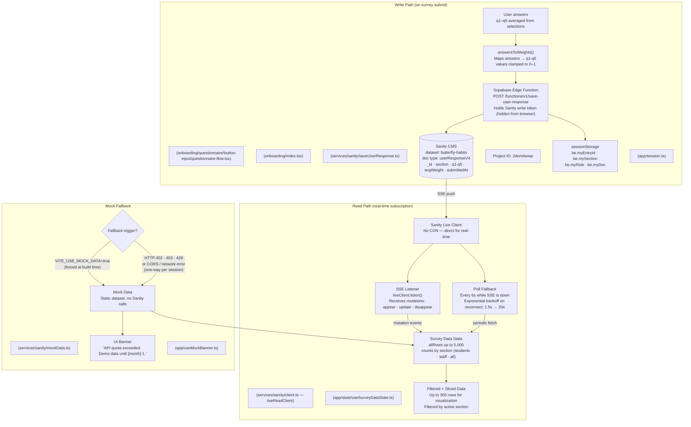

# Data Flow — Sanity Read & Write Paths

```mermaid
flowchart TD

    subgraph WritePath ["Write Path (on survey submit)"]
        Answers["User answers\nq1–q5 averaged from selections"]
        Answers_note["(onboarding/questionnaire/button-input/questionnaire-flow.tsx)"]

        Transform["answersToWeights()\nMaps answers → q1-q5 values clamped to 0–1"]
        Transform_note["(onboarding/index.tsx)"]

        EdgeFn["Supabase Edge Function\nPOST /functions/v1/save-user-response\nHolds Sanity write token (hidden from browser)"]
        EdgeFn_note["(services/sanity/saveUserResponse.ts)"]

        Sanity[("Sanity CMS\ndataset: butterfly-habits\ndoc type: userResponseV4\n_id · section · q1-q5 · avgWeight · submittedAt")]
        Sanity_note["Project ID: 2dnm6wwp"]

        Session["sessionStorage\nbe.myEntryId · be.mySection\nbe.myRole · be.myDoc"]
        Session_note["(app/session.ts)"]

        Answers --> Transform --> EdgeFn
        EdgeFn --> Sanity
        EdgeFn --> Session
    end

    subgraph ReadPath ["Read Path (real-time subscription)"]
        LiveClient["Sanity Live Client\nNo CDN — direct for real-time"]
        LiveClient_note["(services/sanity/client.ts — liveReadClient)"]

        SSE["SSE Listener\nliveClient.listen()\nReceives mutations: appear · update · disappear"]
        Poll["Poll Fallback\nEvery 6s while SSE is down\nExponential backoff on reconnect: 1.5s → 20s"]

        SurveyDataState["Survey Data State\nallRows up to 5,000\ncounts by section (students · staff · all)"]
        SurveyDataState_note["(app/state/useSurveyDataState.ts)"]

        FilteredData["Filtered + Sliced Data\nUp to 300 rows for visualization\nFiltered by active section"]

        LiveClient --> SSE
        LiveClient --> Poll
        SSE -->|"mutation events"| SurveyDataState
        Poll -->|"periodic fetch"| SurveyDataState
        SurveyDataState --> FilteredData
    end

    subgraph MockFallback ["Mock Fallback"]
        MockTrigger{"Fallback trigger?"}
        MockData["Mock Data\nStatic dataset, no Sanity calls"]
        MockData_note["(services/sanity/mockData.ts)"]
        MockBanner["UI Banner\n'API quota exceeded. Demo data until [month] 1.'"]
        MockBanner_note["(app/useMockBanner.ts)"]

        MockTrigger -->|"VITE_USE_MOCK_DATA=true\n(forced at build time)"| MockData
        MockTrigger -->|"HTTP 402 · 403 · 429\nor CORS / network error\n(one-way per session)"| MockData
        MockData --> MockBanner
    end

    Sanity -->|"SSE push"| LiveClient
    MockData --> SurveyDataState
```
