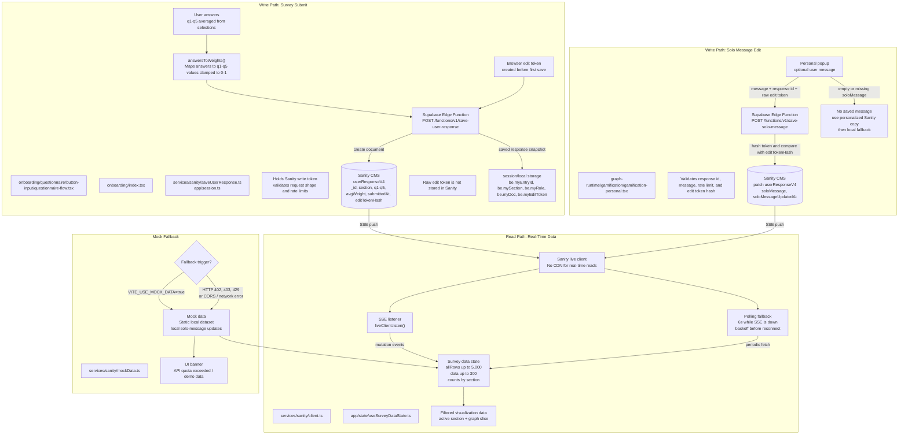

# Data Flow - Sanity Read And Write Paths

## Ownership Token Model

The solo-message edit flow uses a browser-held capability token, not user authentication.

- The frontend creates a random edit token before the first response save.
- `save-user-response` hashes that token and stores only `editTokenHash` on the Sanity document.
- The raw token remains in browser storage next to `be.myEntryId`.
- `save-solo-message` accepts the response id, raw token, and message, then compares the token hash with the stored Sanity hash before patching.
- If the browser loses local storage, the app loses the ability to edit that response.

This keeps the Sanity write token out of the browser and avoids letting any client patch arbitrary survey documents. It is still an anonymous ownership model, so it should be treated as edit capability for one browser instance, not as identity.
