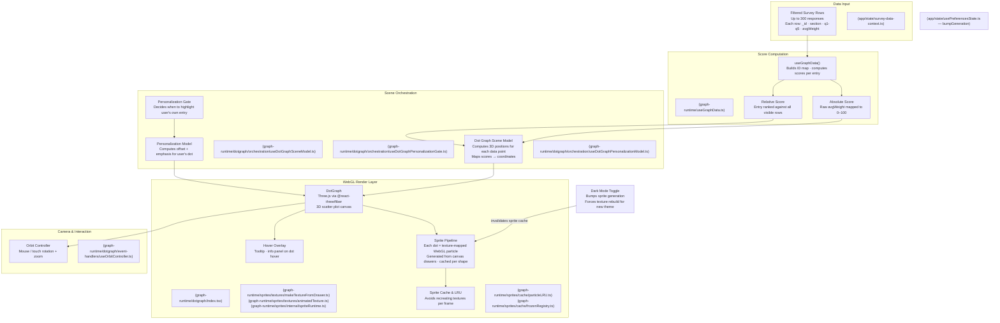

# Graph Runtime — Data Visualization

WebGL-based 3D dot graph. Entirely independent of the canvas engine — no liveAvg or allocAvg. Driven purely by Sanity survey data.

```mermaid
flowchart TD

    subgraph DataIn ["Data Input"]
        SurveyDataCtx["Filtered Survey Rows\nUp to 300 responses\nEach row: _id · section · q1-q5 · avgWeight"]
        SurveyDataCtx_note["(app/state/survey-data-context.ts)"]
    end

    subgraph ScoreLayer ["Score Computation"]
        GraphData["useGraphData()\nBuilds ID map · computes scores per entry"]
        GraphData_note["(graph-runtime/useGraphData.ts)"]

        AbsScore["Absolute Score\nRaw avgWeight mapped to 0–100"]
        RelScore["Relative Score\nEntry ranked against all visible rows"]

        GraphData --> AbsScore
        GraphData --> RelScore
    end

    subgraph Orchestration ["Scene Orchestration"]
        SceneModel["Dot Graph Scene Model\nComputes 3D positions for each data point\nMaps scores → coordinates"]
        SceneModel_note["(graph-runtime/dotgraph/orchestration/useDotGraphSceneModel.ts)"]

        PersonalizationGate["Personalization Gate\nDecides when to highlight user's own entry"]
        PersonalizationGate_note["(graph-runtime/dotgraph/orchestration/useDotGraphPersonalizationGate.ts)"]

        PersonalizationModel["Personalization Model\nComputes offset + emphasis for user's dot"]
        PersonalizationModel_note["(graph-runtime/dotgraph/orchestration/useDotGraphPersonalizationModel.ts)"]

        PersonalizationGate --> PersonalizationModel
    end

    subgraph RenderLayer ["WebGL Render Layer"]
        DotGraph["DotGraph\nThree.js via @react-three/fiber\n3D scatter plot canvas"]
        DotGraph_note["(graph-runtime/dotgraph/index.tsx)"]

        SpritePipeline["Sprite Pipeline\nEach dot = texture-mapped WebGL particle\nGenerated from canvas drawers · cached per shape"]
        SpritePipeline_note["(graph-runtime/sprites/textures/makeTextureFromDrawer.ts)\n(graph-runtime/sprites/textures/animatedTexture.ts)\n(graph-runtime/sprites/internal/spriteRuntime.ts)"]

        SpriteCache["Sprite Cache & LRU\nAvoids recreating textures per frame"]
        SpriteCache_note["(graph-runtime/sprites/cache/particleLRU.ts)\n(graph-runtime/sprites/cache/frozenRegistry.ts)"]

        HoverOverlay["Hover Overlay\nTooltip · info panel on dot hover"]

        DotGraph --> SpritePipeline --> SpriteCache
        DotGraph --> HoverOverlay
    end

    subgraph Interaction ["Camera & Interaction"]
        OrbitController["Orbit Controller\nMouse / touch rotation + zoom"]
        OrbitController_note["(graph-runtime/dotgraph/event-handlers/useOrbitController.ts)"]
    end

    SurveyDataCtx --> GraphData
    AbsScore --> SceneModel
    RelScore --> SceneModel
    SceneModel --> DotGraph
    PersonalizationModel --> DotGraph
    DotGraph --> OrbitController

    DarkModeToggle["Dark Mode Toggle\nBumps sprite generation\nForces texture rebuild for new theme"]
    DarkModeToggle_note["(app/state/usePreferencesState.ts — bumpGeneration)"]
    DarkModeToggle -->|"invalidates sprite cache"| SpritePipeline
```
