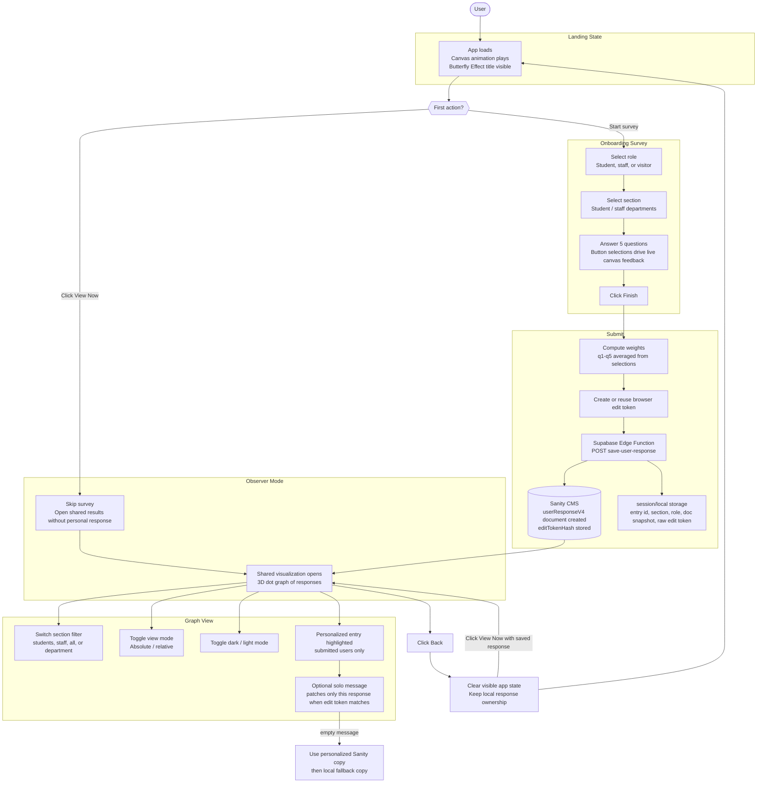

# User Flow

## Notes

- Observer mode can view shared results but cannot edit a personal response because it has no response id or edit token.
- Submitted users can edit the solo message only while the browser still has the matching raw edit token.
- Clicking Back returns to the landing flow without deleting the saved response keys.
- Refreshing also starts on the landing flow; saved response keys only restore identity when the user opens results again.
- Clicking View Now after Back restores the saved response path, not observer mode.
- Taking the survey again replaces the saved response identity with the newest submitted response.
- Clearing browser storage intentionally removes that edit capability.
